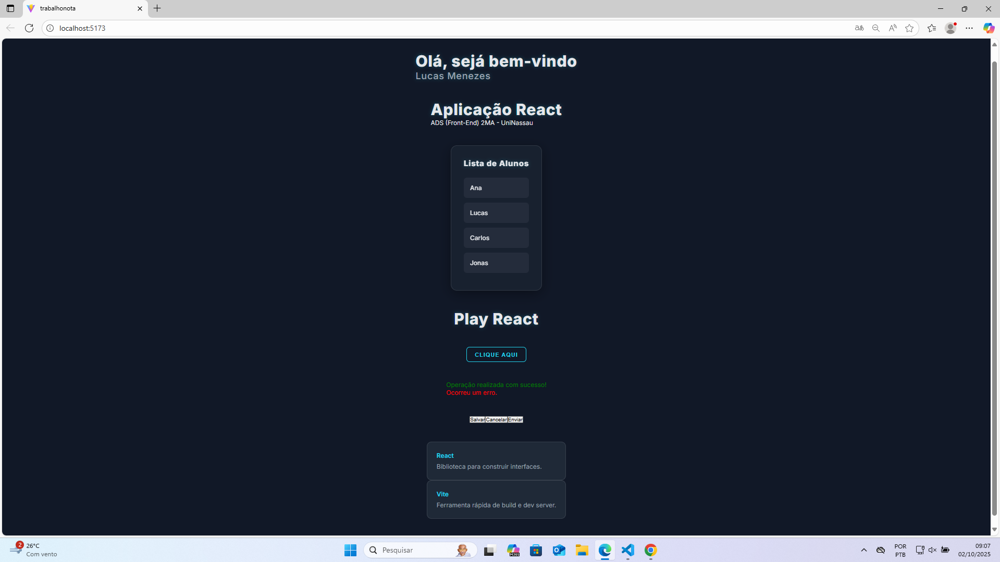

# Projeto com React - ADS UniNassau

Este é um projeto desenvolvido para a disciplina de **Desenvolvimento Front-End** do curso de Análise e Desenvolvimento de Sistemas. O objetivo é construir uma aplicação web simples.

---

## Visualização do Projeto

---

## 👤 Integrante

- **Nome:** Lucas Menezes
- **Matrícula:** 01852632

---

## 🛠️ Tecnologias Utilizadas

Este projeto foi construído com as seguintes tecnologias:

- **[React](https://react.dev/ ):** 
- **[Vite](https://vitejs.dev/ ):** 
- **[CSS Modules](https://github.com/css-modules/css-modules ):** 
- **[JavaScript (ES6+)](https://developer.mozilla.org/pt-BR/docs/Web/JavaScript ):** 
- **[Git](https://git-scm.com/ ):** 
- **[GitHub](https://github.com/ ):**
- **[Vscode](https://code.visualstudio.com/):**
---

## 📋 Funcionalidades Implementadas

-  Crojeto criada com Vite.
-  Aplicação (Header, Footer, ListaAlunos, Card, Button, Alerta).
-  Lista de alunos.
-  Exibição de alertas de status (sucesso, erro, aviso) com mensagens padrão e personalizáveis.
-  Botões de ação reutilizáveis com eventos de clique.
-  Estilização CSS Modules, variáveis CSS.
-  Versionamento de código com commits .
